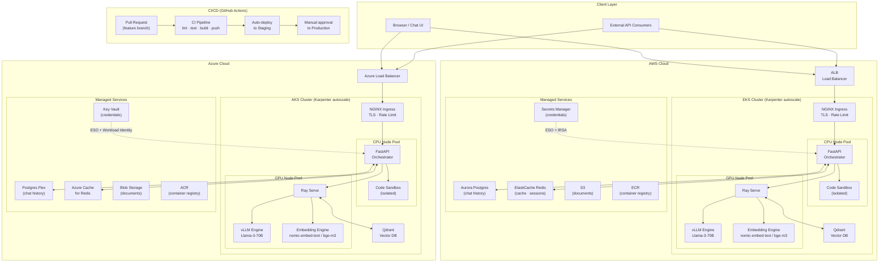
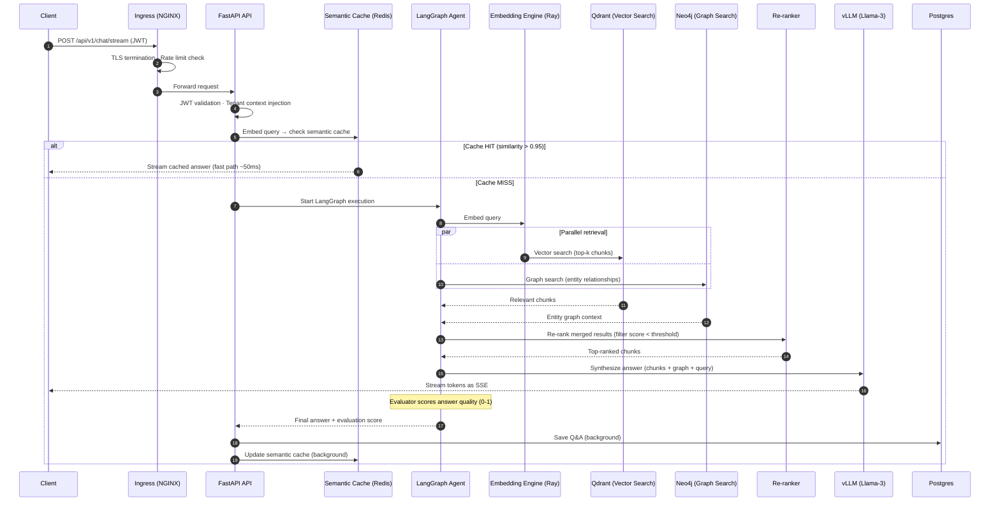
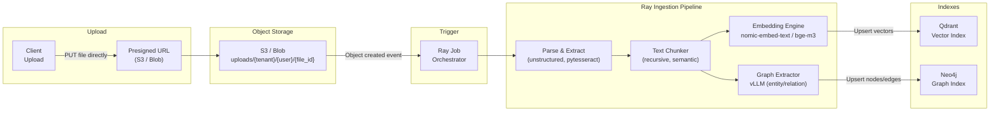
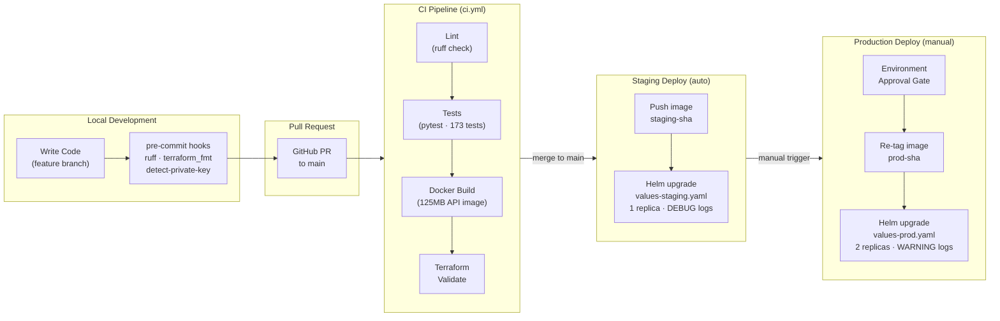
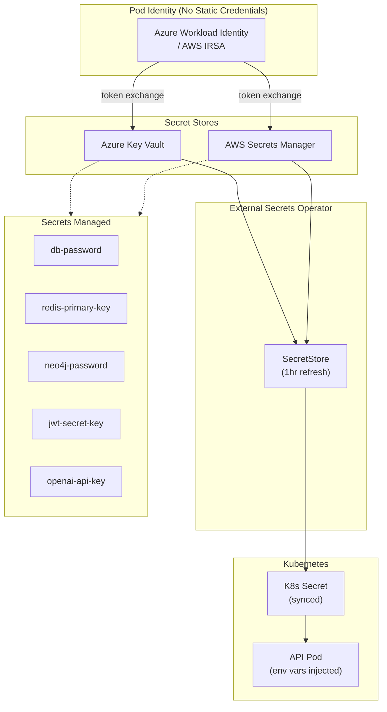
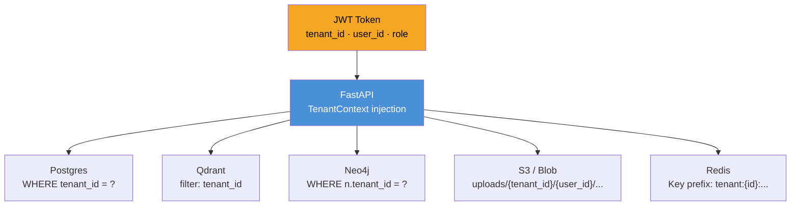

# RAG Platform — Architecture

## Core Principles

1. **Multi-cloud by design** — runs on AWS (EKS) and Azure (AKS) with a provider abstraction layer. No cloud lock-in.
2. **Decoupled compute** — the API orchestrator (CPU) is separate from the AI engines (GPU). Each scales independently.
3. **Hybrid retrieval** — combines vector search (semantic meaning) and graph search (entity relationships) for higher accuracy than either alone.
4. **Async ingestion** — document processing runs as a separate Ray pipeline, never blocking query latency.
5. **Zero static credentials** — all secrets live in Key Vault / Secrets Manager, injected at runtime via Workload Identity.

---

## 1. System Architecture (Multi-Cloud)

---

## 2. Query Request Flow

---

## 3. Document Ingestion Pipeline

---

## 4. CI/CD & Developer Lifecycle

---

## 5. Secrets & Identity Architecture

---

## 6. Multi-Tenant Data Isolation

---

## 7. Re-Ranking Layer

After hybrid retrieval merges vector + graph results, an optional re-ranker re-scores documents for relevance:

| Provider | Env Var | Latency | Use Case |
|----------|---------|---------|----------|
| `none` | `RERANKER_PROVIDER=none` | 0ms | Dev (fast iteration) |
| `llm` | `RERANKER_PROVIDER=llm` | ~200ms | Staging (single LLM call scores N docs) |
| `cross_encoder` | `RERANKER_PROVIDER=cross_encoder` | ~50ms | Production (dedicated Ray Serve model) |

**Design decisions:**
- Scores normalized to 0.0–1.0 range
- Threshold filtering (default 0.3) removes irrelevant chunks but always keeps at least 1
- Graceful failure — any error falls back to original document order
- Graph results are prioritized (merged before vector results)

---

## 8. Evaluator Node

The final LangGraph node scores answer quality on a 0-1 scale:
- Checks if the answer is grounded in the retrieved sources
- Detects hallucination or unsupported claims
- Score is returned to the client in the SSE stream
- Can be used for automated quality monitoring and feedback loops

---

## Component Summary

| Component | AWS | Azure | Purpose |
|-----------|-----|-------|---------|
| Kubernetes | EKS + Karpenter | AKS + Karpenter | Container orchestration, autoscaling |
| API | FastAPI (125MB image) | FastAPI (125MB image) | Query orchestration, auth, streaming |
| AI engines | Ray Serve + vLLM + Embedding | Ray Serve + vLLM + Embedding | LLM inference, embeddings (nomic-embed-text / bge-m3) |
| Re-ranker | none / LLM / cross-encoder | none / LLM / cross-encoder | Post-retrieval relevance scoring |
| Vector DB | Qdrant (in-cluster) | Qdrant (in-cluster) | Semantic similarity search |
| Graph DB | Neo4j AuraDB | Neo4j AuraDB | Entity relationship queries |
| Relational DB | Aurora Postgres | Postgres Flexible Server | Chat history, session state |
| Cache | ElastiCache Redis | Azure Cache for Redis | Semantic cache, rate limiting |
| Object storage | S3 | Blob Storage | Document storage, presigned uploads |
| Container registry | ECR | ACR | Docker images |
| Secret store | Secrets Manager + IRSA | Key Vault + Workload Identity | Credential management |
| Ingress | NGINX | NGINX | TLS termination, rate limiting |
| Observability | AWS X-Ray + CloudWatch | Azure Monitor + App Insights | Tracing, logging, metrics |

---

## Related Docs

- [AWS Deployment](deployment-aws.md) — EKS provisioning, staging/prod, bootstrap, cost management
- [Azure Deployment](deployment-azure.md) — AKS provisioning, Workload Identity, Key Vault
- [API Reference & Chat UI](api-reference.md) — endpoints, streaming protocol, sample queries
- [Operations Guide](operations.md) — CI/CD, observability, testing, security, troubleshooting
- [Request Flow](request_flow.md) — detailed step-by-step query lifecycle
- [Security](security.md) — security controls and threat model
- [Scaling](scaling.md) — autoscaling strategy and capacity planning
- [Roadmap](ROADMAP.md) — enterprise features and zero trust roadmap
