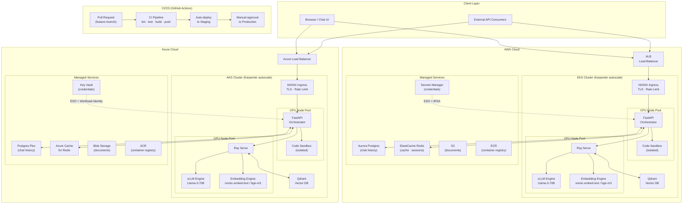
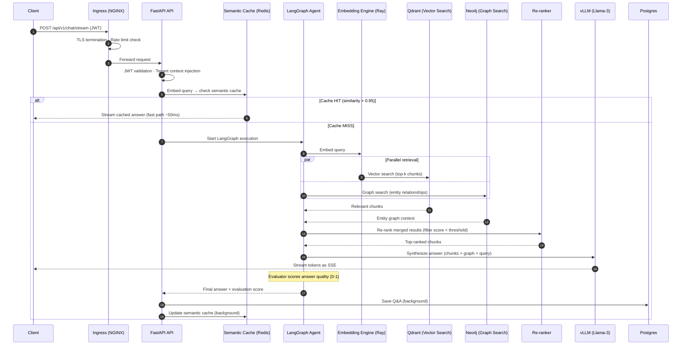
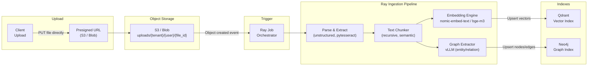
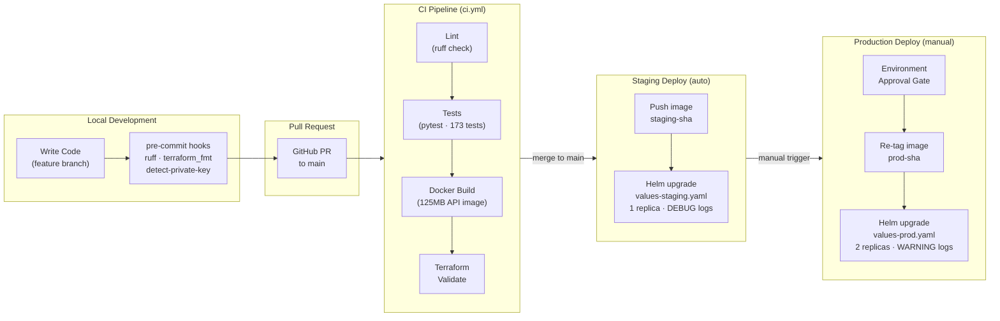
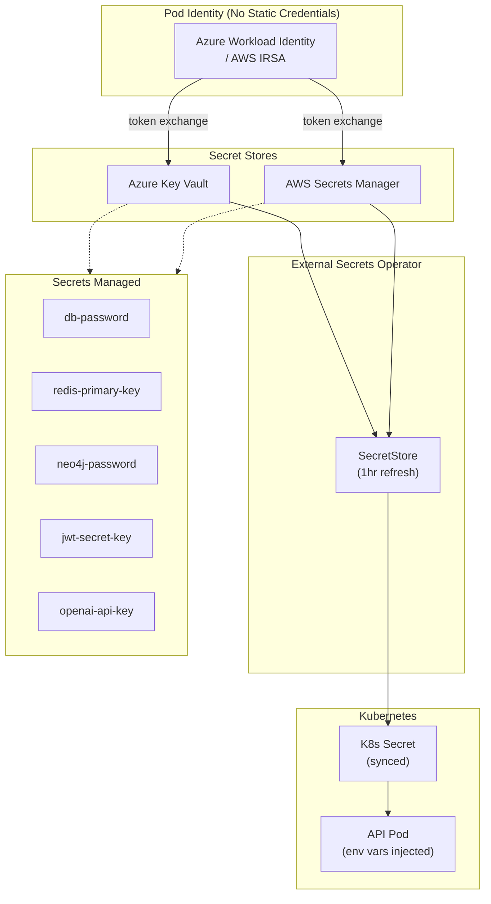
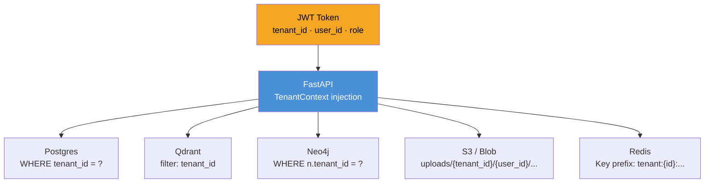
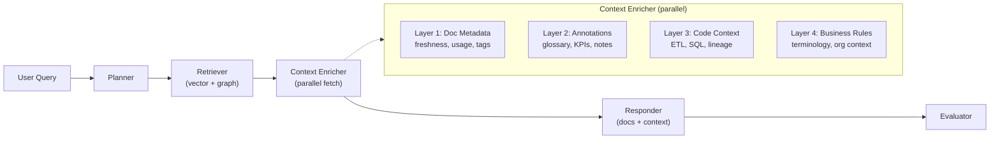
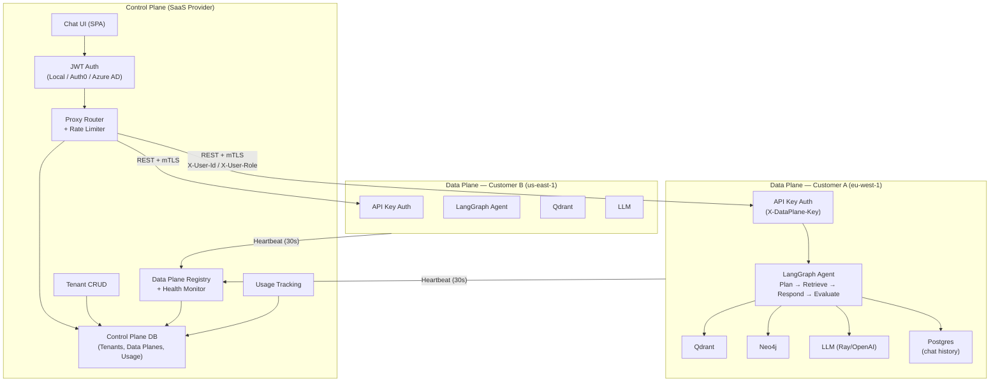

# RAG Platform — Architecture

## Core Principles

1. **Multi-cloud by design** — runs on AWS (EKS) and Azure (AKS) with a provider abstraction layer. No cloud lock-in.
2. **Decoupled compute** — the API orchestrator (CPU) is separate from the AI engines (GPU). Each scales independently.
3. **Hybrid retrieval** — combines vector search (semantic meaning) and graph search (entity relationships) for higher accuracy than either alone.
4. **Async ingestion** — document processing runs as a separate Ray pipeline, never blocking query latency.
5. **Zero static credentials** — all secrets live in Key Vault / Secrets Manager, injected at runtime via Workload Identity.

---

## 1. System Architecture (Multi-Cloud)



---

## 2. Query Request Flow



---

## 3. Document Ingestion Pipeline



---

## 4. CI/CD & Developer Lifecycle



---

## 5. Secrets & Identity Architecture



---

## 6. Multi-Tenant Data Isolation



---

## 7. Re-Ranking Layer

After hybrid retrieval merges vector + graph results, an optional re-ranker re-scores documents for relevance:

| Provider | Env Var | Latency | Use Case |
|----------|---------|---------|----------|
| `none` | `RERANKER_PROVIDER=none` | 0ms | Dev (fast iteration) |
| `llm` | `RERANKER_PROVIDER=llm` | ~200ms | Staging (single LLM call scores N docs) |
| `cross_encoder` | `RERANKER_PROVIDER=cross_encoder` | ~50ms | Production (dedicated Ray Serve model) |

**Design decisions:**
- Scores normalized to 0.0–1.0 range
- Threshold filtering (default 0.3) removes irrelevant chunks but always keeps at least 1
- Graceful failure — any error falls back to original document order
- Graph results are prioritized (merged before vector results)

---

## 8. Evaluator Node

The final LangGraph node scores answer quality on a 0-1 scale:
- Checks if the answer is grounded in the retrieved sources
- Detects hallucination or unsupported claims
- Score is returned to the client in the SSE stream
- Can be used for automated quality monitoring and feedback loops

---

## 9. Context Layer Architecture

The platform includes an optional **Context Layer Architecture** that enriches every RAG response with structured business knowledge. Inspired by enterprise data agent patterns, it adds four overlapping context layers between the retriever and responder nodes, transforming answers from "here's what the document says" to "here's what it means in your business context."

### Feature Flag

Disabled by default — zero impact on existing behavior:

| Setting | Default | Description |
|---------|---------|-------------|
| `CONTEXT_LAYERS_ENABLED` | `false` | Master toggle for the entire context layer system |
| `CONTEXT_LAYER1_ENABLED` | `true` | Document metadata & usage signals |
| `CONTEXT_LAYER2_ENABLED` | `true` | Human annotations & glossary |
| `CONTEXT_LAYER3_ENABLED` | `true` | Code & pipeline context |
| `CONTEXT_LAYER4_ENABLED` | `true` | Institutional / business rules |
| `CONTEXT_LAYERS_MAX_TOKENS` | `1500` | Token budget for context block |
| `CONTEXT_FRESHNESS_DECAY_DAYS` | `90` | Freshness score half-life (days) |

### Query Flow with Context Layers



### The Four Layers

**Layer 1 — Document Metadata & Usage Signals**
- Fetches freshness scores, access frequency, summaries, and tags for retrieved documents
- Uses exponential decay for freshness scoring (configurable half-life)
- Updates access tracking as a side effect (last accessed, access count)
- Stored in `document_metadata` Postgres table, populated during ingestion

**Layer 2 — Human Annotations & Glossary**
- Matches glossary definitions, KPI formulas, and document notes against query terms
- Uses ILIKE pattern matching with stop-word filtering
- Stored in `annotations` Postgres table, managed via Admin API

**Layer 3 — Code & Pipeline Context**
- Fetches relevant ETL pipeline descriptions, SQL context, API endpoint docs, and data lineage
- Includes upstream/downstream dependency information
- Stored in `code_context` Postgres table, managed via Admin API

**Layer 4 — Institutional / Business Context**
- Fetches business rules, organizational terminology, and role-specific context
- Filtered by `applies_to_roles` matching the requesting user's role
- Priority-ordered (higher priority rules surface first)
- Stored in `business_context` Postgres table, managed via Admin API

### Token Budget & Priority

The assembler merges all layer outputs under a configurable token budget (default 1500 tokens). When the budget is exceeded, layers are prioritized:

1. **Business Rules** (highest priority — domain-critical definitions)
2. **Annotations** (glossary terms directly relevant to the query)
3. **Metadata** (document freshness and usage signals)
4. **Code Context** (pipeline and lineage information)

### Admin API

All context layer data is managed through REST endpoints at `/api/v1/context/`:

- **Annotations**: CRUD for glossary terms, KPI definitions, and document notes
- **Business Rules**: CRUD for terminology, business rules, role-specific context
- **Code Context**: CRUD for ETL pipeline docs, SQL descriptions, data lineage
- **Document Metadata**: Read-only (auto-populated during ingestion)

See [API Reference](api-reference.md#context-layer-admin-api) for full endpoint documentation.

### Data Model

All four tables are tenant-scoped and auto-created on startup via SQLAlchemy:

```
services/api/app/context/
├── __init__.py
├── models.py              # 4 Postgres table models
├── base.py                # ContextLayerProvider protocol
├── layer1_metadata.py     # Document metadata & usage
├── layer2_annotations.py  # Glossary, KPIs, notes
├── layer3_code.py         # Code/pipeline context
├── layer4_business.py     # Business rules, terminology
├── assembler.py           # Orchestrates all layers (parallel fetch + token budget)
└── manager.py             # CRUD operations for admin API
```

---

## Component Summary

| Component | AWS | Azure | Purpose |
|-----------|-----|-------|---------|
| Kubernetes | EKS + Karpenter | AKS + Karpenter | Container orchestration, autoscaling |
| API | FastAPI (125MB image) | FastAPI (125MB image) | Query orchestration, auth, streaming |
| AI engines | Ray Serve + vLLM + Embedding | Ray Serve + vLLM + Embedding | LLM inference, embeddings (nomic-embed-text / bge-m3) |
| Re-ranker | none / LLM / cross-encoder | none / LLM / cross-encoder | Post-retrieval relevance scoring |
| Vector DB | Qdrant (in-cluster) | Qdrant (in-cluster) | Semantic similarity search |
| Graph DB | Neo4j AuraDB | Neo4j AuraDB | Entity relationship queries |
| Relational DB | Aurora Postgres | Postgres Flexible Server | Chat history, session state |
| Cache | ElastiCache Redis | Azure Cache for Redis | Semantic cache, rate limiting |
| Object storage | S3 | Blob Storage | Document storage, presigned uploads |
| Container registry | ECR | ACR | Docker images |
| Secret store | Secrets Manager + IRSA | Key Vault + Workload Identity | Credential management |
| Ingress | NGINX | NGINX | TLS termination, rate limiting |
| Observability | AWS X-Ray + CloudWatch | Azure Monitor + App Insights | Tracing, logging, metrics |

---

## 9. Control Plane / Data Plane Architecture

The platform supports a **split-plane deployment** for SaaS scenarios with data residency requirements. The monolith can be decomposed into two independent services:

- **Control Plane** — SaaS management layer (your cloud): auth, tenant management, routing, rate limiting, usage tracking
- **Data Plane** — Query processing (customer's cloud/region): LLM inference, embeddings, vector/graph search, chat history

One customer = one dedicated Data Plane. Each data plane runs in the customer's cloud region for data residency compliance.

### Deployment Modes

| Mode | `DEPLOYMENT_MODE` | Use Case |
|------|-------------------|----------|
| `monolith` | (default) | Single-instance dev/prod — everything in one FastAPI process |
| `control_plane` | CP only | SaaS management layer: auth, routing, proxy, admin |
| `data_plane` | DP only | Customer-deployed: query processing in `SINGLE_TENANT_MODE` |

### Split Architecture Diagram



### Communication Protocol

| Direction | Mechanism | Authentication |
|-----------|-----------|----------------|
| User → Control Plane | HTTPS | JWT (Bearer token) |
| Control Plane → Data Plane | REST + optional mTLS | `X-DataPlane-Key` header |
| Data Plane → Control Plane | REST (registration + heartbeat) | `X-Internal-Key` header |
| User identity forwarding | HTTP headers | `X-User-Id` + `X-User-Role` |

### Key Components

| Component | Control Plane | Data Plane |
|-----------|--------------|------------|
| **Auth** | JWT validation (HS256/RS256 + JWKS) | API key from control plane |
| **Database** | Tenants, data planes, usage events | Chat history, sessions |
| **Routing** | Resolve tenant → data plane, streaming proxy | N/A (receives proxied requests) |
| **Rate Limiting** | Per-tenant sliding window (configurable RPM) | N/A (enforced at CP) |
| **Health** | Monitors data planes via heartbeat | Registers + sends heartbeats |
| **Chat UI** | Serves SPA at `/` | Not served (CP handles UI) |
| **AI Pipeline** | Not present | Full LangGraph agent pipeline |

### Service Directory Layout

```
services/
├── api/                    # Monolith (original, still works standalone)
├── control-plane/          # Control Plane service
│   ├── app/
│   │   ├── auth/           # JWT auth (local + JWKS)
│   │   ├── middleware/     # Per-tenant rate limiting
│   │   ├── models/         # Tenant, DataPlane, UsageEvent (SQLAlchemy)
│   │   ├── proxy/          # Streaming proxy, mTLS, tenant routing
│   │   ├── registry/       # Data plane health monitor
│   │   └── routes/         # Auth, tenants, data planes, proxy, usage, health
│   ├── main.py             # FastAPI app (port 8001)
│   └── Dockerfile
└── data-plane/             # Data Plane service
    ├── app/
    │   ├── auth/           # API key validation + user context
    │   ├── config.py       # Data plane settings
    │   ├── registration/   # Heartbeat loop to control plane
    │   └── routes/         # Chat, upload, health
    ├── main.py             # FastAPI app (port 8080)
    └── Dockerfile
```

---

## Related Docs

- [AWS Deployment](deployment-aws.md) — EKS provisioning, staging/prod, bootstrap, cost management
- [Azure Deployment](deployment-azure.md) — AKS provisioning, Workload Identity, Key Vault
- [API Reference & Chat UI](api-reference.md) — endpoints, streaming protocol, sample queries
- [Operations Guide](operations.md) — CI/CD, observability, testing, security, troubleshooting
- [Request Flow](request_flow.md) — detailed step-by-step query lifecycle (monolith + split modes)
- [Security](security.md) — security controls, mTLS, API key auth
- [Scaling](scaling.md) — autoscaling strategy, per-tenant data planes
- [Roadmap](ROADMAP.md) — enterprise features and zero trust roadmap
