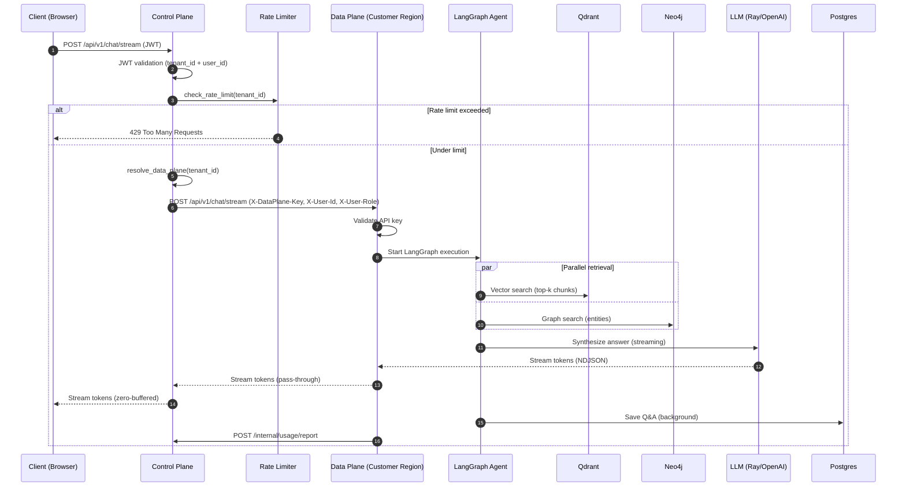
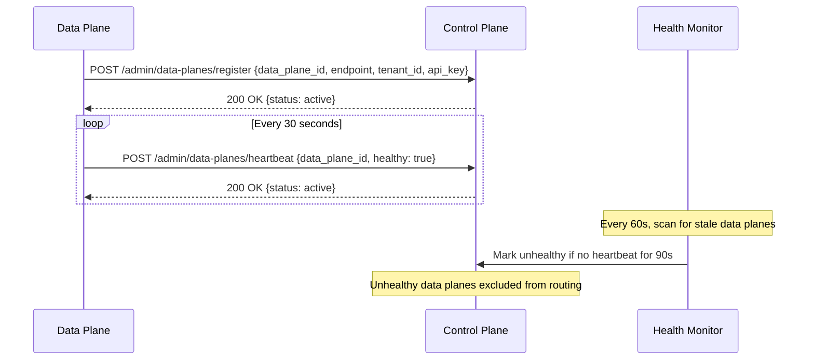

# Request Lifecycle

## Monolith Mode (Default)

This details the journey of a user's chat message through the single-service monolith deployment.

1.  **Client Request:** The user sends a `POST` request to `api.your-rag-platform.com/api/v1/chat/stream`.
2.  **Load Balancer:** AWS ALB receives the request and forwards it to the EKS Ingress.
3.  **Ingress Controller (Nginx/Kong):**
    *   Applies TLS termination.
    *   Executes Lua script for rate limiting.
    *   Routes the request to the `api-service`.
4.  **FastAPI Orchestrator (`chat.py`):**
    *   **Auth:** `jwt.py` validates the Bearer token.
    *   **Semantic Cache:** `semantic.py` embeds the query and checks Qdrant/Redis for a similar past query. If a match > 0.95 is found, the cached answer is streamed back immediately (**Path A - Fast Path**).
5.  **LangGraph Execution (Path B - RAG Path):**
    *   **Planner Node:** The query is sent to Llama-3 to be refined or to decide on a tool.
    *   **Retriever Node:**
        *   The query is embedded via the Ray Embedding Engine.
        *   `asyncio.gather` runs Vector Search (Qdrant) and Graph Search (Neo4j) in parallel.
    *   **Responder Node:** The retrieved context and the query are sent to the Ray vLLM Engine (Llama-3-70B) to synthesize the final answer.
6.  **Streaming Response:**
    *   The FastAPI `StreamingResponse` sends events back to the user as each LangGraph node completes.
    *   The final answer is streamed to the client.
7.  **Background Tasks:**
    *   The Q&A pair is saved to the Aurora database.
    *   The new Q&A pair is added to the semantic cache.

---

## Split-Plane Mode (SaaS with Data Residency)

In split-plane deployment, the request traverses two services: the Control Plane (SaaS provider) and the Data Plane (customer's environment).

### Step-by-step

1. **Client -> Control Plane:** User sends `POST /api/v1/chat/stream` with JWT bearer token.
2. **JWT Validation:** Control plane validates JWT, extracts `tenant_id` and `user_id`.
3. **Rate Limiting:** Per-tenant sliding window counter checks if the tenant is under their RPM limit.
4. **Tenant Routing:** Control plane resolves `tenant_id` -> data plane endpoint from its registry (with in-memory cache + TTL).
5. **Streaming Proxy:** Control plane opens `httpx.AsyncClient.stream()` to the data plane, forwarding:
   - `X-DataPlane-Key` header (shared secret for authentication)
   - `X-User-Id` header (forwarded user identity)
   - `X-User-Role` header (forwarded user role)
6. **Data Plane Auth:** Data plane validates the `X-DataPlane-Key` against its configured API key.
7. **RAG Pipeline:** Data plane executes the full LangGraph agent (plan -> retrieve -> respond -> evaluate). This is identical to monolith mode but with `SINGLE_TENANT_MODE=True` (no tenant_id filtering since the entire data plane serves one customer).
8. **Streaming Response:** Tokens stream back through: LLM -> Data Plane -> Control Plane -> Client. The control plane does **zero-buffered pass-through** (NDJSON line-by-line forwarding).
9. **Usage Reporting:** Data plane reports usage metrics (tokens consumed, queries) to control plane's `/internal/usage/report` endpoint.

### Data Plane Registration and Health

