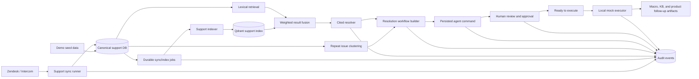
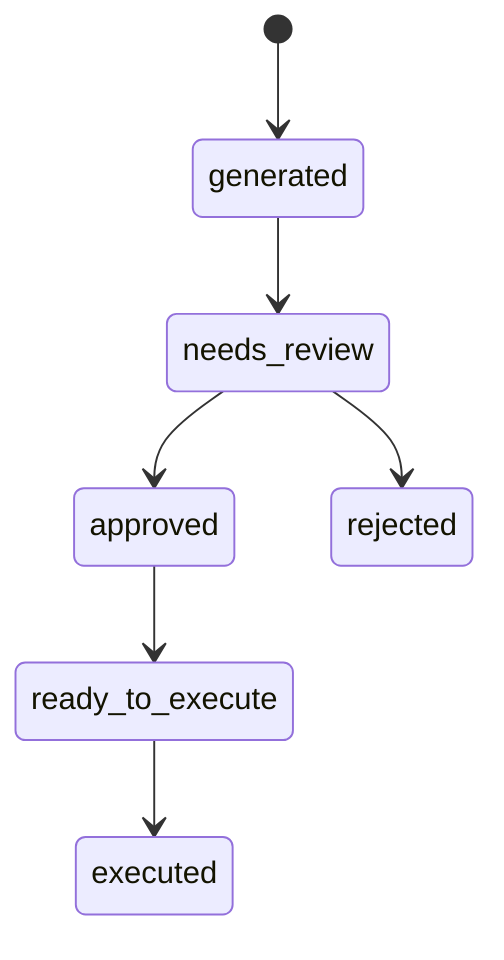

# Customer Support Resolution Intelligence Architecture

## Architecture Decision

Resolution Intelligence is a domain-specific workflow built on the existing Compass
control-plane/data-plane architecture. It remains helpdesk-neutral, evidence-first,
tenant-scoped, and safe for enterprise pilots.

The current local workflow is:

connectors -> canonical support data -> durable sync/index jobs -> repeat issue
clustering -> hybrid retrieval -> evidence-backed playbook -> agent command -> human
approval -> local execution artifacts -> audit trail.

External write-back is not enabled. Local execution demonstrates the trust and
execution contract without changing Zendesk, Intercom, a knowledge base, or a product
tracker.

## Current Components

Backend:
- `support_integrations`: connector catalog and connection state for Zendesk/Intercom.
- `support.sync`: provider sync runners.
- `support.models`: canonical tickets, comments, articles, sync runs, index records,
  durable jobs, and persisted support actions.
- `support.jobs`: durable sync/index job state and worker execution.
- `support.indexer`: support-specific Qdrant indexing plus vector/lexical search fusion.
- `support.lexical`: exact-term scoring for errors, IDs, product names, and plan names.
- `support.insights`: repeat-ticket clustering from normalized support tickets.
- `support.resolver`: cited resolution generation from fused retrieval results.
- `support.workflow`: playbook, knowledge-gap, and deflection-estimate assembly.
- `audit.manager`: tenant/user-attributed events for support operations and actions.

Frontend:
- `/support`: operating console for demo reset/seed, sync/index jobs, repeat insights,
  search, cited resolution, playbook generation, action review, approval, and local
  execution results.

## Data And Execution Flow

## Domain Model

Computed workflow entities:
- `IssueCluster`: repeated issue derived from tags, subjects, categories, and status mix.
- `IssueSignature`: normalized signals identifying the issue cluster.
- `EvidenceSource`: ticket, comment, or article chunk supporting a recommendation.
- `ResolutionPlaybook`: reviewable instructions and customer-response draft.
- `KnowledgeGap`: missing or stale macro, help-center, product, or internal guidance.
- `DeflectionEstimate`: estimated avoidable repeats and agent time, with assumptions.

Persisted execution entity:
- `SupportAction`: tenant-scoped agent command containing the originating workflow,
  review state, approver and executor identity, timestamps, notes, and execution result.

Accepted playbooks are currently preserved inside `SupportAction.workflow`. A future
pilot-quality playbook registry should add explicit corpus/index versioning and impact
measurement.

## Action State Model

The UI follows this review sequence. The API accepts the known statuses
`generated`, `needs_review`, `approved`, `ready_to_execute`, `executed`, and
`rejected`; `executed` can only be entered through the execute endpoint, and execution
returns HTTP 409 unless the action is `ready_to_execute`.

The current executor uses `mode: local_mock`. It produces reviewable macro, KB update,
and product follow-up artifacts and explicitly records that no external system changed.
Future integrations must preserve this state model while adding connector-specific
permissions, idempotency keys, retries, rollback/compensation behavior, and external
resource identifiers.

## API Surface

Support memory and workflow:
- `POST /api/v1/support/demo/seed`
- `POST /api/v1/support/jobs/sync-index`
- `GET /api/v1/support/jobs`
- `GET /api/v1/support/jobs/summary`
- `GET /api/v1/support/jobs/{job_id}`
- `POST /api/v1/support/jobs/{job_id}/cancel`
- `POST /api/v1/support/jobs/{job_id}/retry`
- `POST /api/v1/support/sync/{provider}`
- `POST /api/v1/support/index`
- `GET /api/v1/support/insights/repeats`
- `POST /api/v1/support/insights/repeats/workflow`
- `GET /api/v1/support/search`
- `POST /api/v1/support/resolve`
- `GET /api/v1/support/tickets`
- `GET /api/v1/support/sync-runs`

Trust and execution:
- `POST /api/v1/support/actions`
- `GET /api/v1/support/actions`
- `DELETE /api/v1/support/actions`
- `POST /api/v1/support/actions/{action_id}/status`
- `POST /api/v1/support/actions/{action_id}/execute`

Connector management is exposed under `/api/v1/support-integrations`.

## Evidence And Retrieval Rules

Current retrieval:
- Qdrant vector search finds semantically similar ticket/article chunks.
- Database-backed lexical search rewards exact query terms and support metadata.
- Weighted fusion combines vector and lexical ranks and returns `vector_score`,
  `lexical_score`, `fusion_score`, and `retrieval_source` trace fields.
- The resolver cites the fused results used in its response.

Current evidence gates:
- No matches produce low confidence and human routing.
- Strong cited matches can produce a playbook ready for agent review.
- Solved-ticket evidence without article evidence creates a KB/macro recommendation.
- Article evidence with continuing repeats creates a refresh/discoverability recommendation.
- Customer-facing drafts remain review-required.

Still required for external automation:
- source visibility enforcement before customer-facing text;
- deterministic claim-to-source verification and unsupported-claim blocking;
- cross-encoder reranking and retrieval-quality evaluation;
- persisted corpus/index version on accepted playbooks;
- precision@k, recall@k, citation coverage, and unsupported-claim evaluation in CI.

## Security, Trust, And Audit

Current controls:
- tenant-scoped storage, indexing, retrieval, actions, and action reset;
- authenticated user identity recorded for creation, approval, and execution;
- execution blocked until `ready_to_execute`;
- audit events for sync, index, resolve, workflow generation, action creation/status/reset,
  and execution success or failure;
- no direct reply, KB publication, or ticket mutation in local v1;
- control-plane/data-plane split remains the enterprise deployment direction.

Before real connector execution:
- enforce role/permission policy for review, approval, and execution separately;
- prevent an action creator from approving where customer policy requires separation;
- validate source visibility and destination scope;
- add idempotent connector adapters and durable execution attempts;
- store immutable request, decision, result, and external resource identifiers;
- support retry policy and compensating/rollback actions where the destination permits.

## Delivery Status

Completed locally:
- demo seed and reset;
- durable sync/index jobs;
- repeat clusters and deflection estimate;
- vector plus lexical retrieval fusion and trace fields;
- cited playbook and knowledge-gap recommendation;
- persisted agent commands;
- review, approval, rejection, readiness, and local execution flow;
- audit events and reviewable execution artifacts.

Pilot readiness still requires:
- Zendesk sandbox validation;
- Intercom sandbox validation;
- visibility filtering and deterministic citation verification;
- stronger role/permission policy and separation of duties;
- real connector execution adapters with idempotency and recovery;
- before/after repeat-ticket measurement and pilot ROI reporting.
